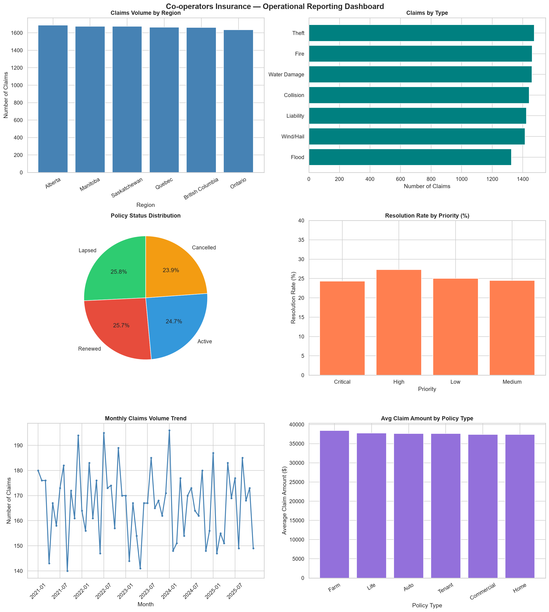

# Insurance Operational Reporting Analysis
### Co-operators Insurance — Retail Sales Division | 2021–2025

**Prepared by:** Sandra Igboanugo  
**Tools:** Python · Pandas · Matplotlib · Seaborn · Jupyter Notebook  
**Dataset:** 40,000 synthetic records across 4 operational tables  
**Scope:** Portfolio Analysis · Claims Reporting · Support Operations · Data Quality & Reconciliation

---

## Project Overview

This project simulates the core responsibilities of a data and reporting analyst within an insurance operations environment. Using a synthetic dataset modelled on real P&C insurance operations, the analysis covers four key operational domains: policy portfolio management, claims reporting, support request tracking, and cross-table data reconciliation.

The project demonstrates the ability to execute BAU reporting tasks, conduct data quality validation, produce operational dashboards, and synthesize findings into executive-ready summaries — skills directly aligned with associate-level data and reporting analyst roles in the financial services sector.

---

## Repository Structure

```
insurance-operational-reporting/
│
├── coops_reporting_analysis.ipynb   # Full analysis notebook
├── operational_dashboard.png        # Six-panel reporting dashboard
├── agents.csv                       # Agent performance data (10,000 rows)
├── policies.csv                     # Policy portfolio data (10,000 rows)
├── claims.csv                       # Claims data (10,000 rows)
├── support_requests.csv             # Support request data (10,000 rows)
└── README.md                        # Project documentation
```

---

## Dataset Overview

Four interrelated tables were constructed to reflect realistic insurance operational data across six Canadian provinces (Alberta, British Columbia, Ontario, Quebec, Manitoba, Saskatchewan) spanning January 2021 to December 2025.

| Table | Rows | Key Fields |
|---|---|---|
| agents.csv | 10,000 | agent_id, region, team, policies_sold, claims_handled, avg_resolution_days |
| policies.csv | 10,000 | policy_id, policy_type, region, premium_amount, status, auto_renew, end_date |
| claims.csv | 10,000 | claim_id, claim_type, claim_amount, approved_amount, status, days_to_resolve |
| support_requests.csv | 10,000 | request_id, request_type, priority, status, submitted_date, resolved_date |

---

## Analysis Sections

---

### 1. Data Quality & Reconciliation

Conducted a full data quality audit across all four tables followed by cross-table reconciliation to confirm referential integrity. This mirrors standard validation practices required before any BAU reporting cycle.


**Findings:**
- Zero duplicate records identified across all 40,000 rows
- Zero missing values in agents, policies, and claims tables
- 14,944 expected null values confirmed in support_requests — limited to unresolved ticket fields only, confirming no data integrity issues
- 100% referential integrity confirmed: every claim links to a valid policy and agent; every support request links to a valid agent

---

### 2. Claims Operational Report

Analyzed 10,000 claims records across six Canadian provinces to produce recurring operational reporting aligned with BAU requirements.


**Claims by Region**
Regional claims volume and average resolution times were calculated across all six provinces. British Columbia, Ontario, and Saskatchewan carry the highest total claim volumes, supporting resource allocation and regional performance tracking decisions.

**Claims by Type**
Theft and Fire represent the highest volume claim categories. Cross-referencing total claimed amounts against approved amounts by claim type provides a reconciliation baseline for audit and financial reporting purposes.

**Claims by Status**
Status distribution across Open, In Review, Approved, Denied, and Closed stages provides real-time pipeline visibility for claims leadership and escalation decision making.

**High Value Claims Flag**
3,288 claims exceeding $50,000 were flagged representing elevated financial exposure. Proactive identification of high-value claims supports risk escalation workflows and senior leadership reporting.

---

### 3. Policy Portfolio Report

Analyzed a portfolio of 10,000 insurance policies across six provinces and six policy types to produce recurring portfolio performance reporting.


**Key Metrics:**
- Total Portfolio Premium: $42,442,196
- Active Policies: 2,468 (24.7%)
- Lapsed or Cancelled: 4,961 (49.6%)
- Auto-Renew Rate: 50.7%
- Policies Expiring Within 90 Days: 490
- Premium at Risk: $2,049,767.18

**Regional Premium Analysis**
British Columbia leads total premium at $7.2M followed closely by Ontario and Saskatchewan. Average premiums are consistent across regions ranging from $4,159 to $4,315, indicating balanced pricing across the national portfolio.

**Policy Type Analysis**
Home and Commercial policies generate the highest total premiums. Average premiums are consistent across all six product types ranging from $4,156 to $4,347.

---

### 4. Support Request Operational Report

Analyzed 10,000 support requests across six request types to produce operational visibility into request volume, resolution performance, and escalation risk.


**Key Metrics:**
- Total Requests: 10,000
- Resolved: 2,528 (25.3%)
- Unresolved: 7,472
- Critical Unresolved: 1,933
- Avg Resolution Time (Critical): 15.9 days

**Resolution Rate by Priority**
High priority requests show the strongest resolution rate at approximately 27% while Critical, Low, and Medium track between 24–25%. The narrow spread across priority levels suggests resolution workflows are not yet effectively differentiated by urgency — a finding that supports SLA review recommendations.

**Request Type Breakdown**
Ad-hoc Analysis and Dashboard Update requests represent the highest volume categories at 1,728 and 1,716 respectively, reflecting the consistently diverse operational support workload typical of a reporting analyst function.

---

### 5. Operational Reporting Dashboard

Developed a six-panel operational dashboard translating raw insurance data into visual reporting ready for leadership review and BAU reporting cycles.




**Dashboard Panels:**
- Claims Volume by Region — bar chart
- Claims by Type — horizontal bar chart
- Policy Status Distribution — pie chart
- Resolution Rate by Priority — bar chart
- Monthly Claims Volume Trend — line chart (2021–2025)
- Average Claim Amount by Policy Type — bar chart

**Key Visual Findings:**
- Claims volume is evenly distributed across all six provinces with no single region representing a disproportionate risk concentration
- The portfolio shows a near-equal four-way split across Active, Lapsed, Renewed, and Cancelled policy statuses
- Monthly claims volume fluctuates between 140 and 195 per month across the five-year period with no significant seasonal pattern
- Average claim amounts are consistent across all six policy types hovering near $37,500

---

### 6. Executive Summary & Key Findings

Synthesized findings across 40,000 records into a structured executive summary covering portfolio health, claims exposure, support operations, and data quality — mirroring the format of a real BAU reporting deliverable.


**Five Risk Flags Identified:**

| # | Flag | Finding | Recommendation |
|---|---|---|---|
| 1 | Retention Risk | 4,961 policies (49.6%) lapsed or cancelled | Targeted renewal campaigns |
| 2 | Premium at Risk | 490 policies expiring in 90 days = $2,049,767 at risk | Immediate outreach prioritization |
| 3 | Claims Exposure | 3,288 high value claims exceeding $50,000 | Priority review and escalation |
| 4 | Support Backlog | 25.3% resolution rate with 1,933 critical requests unresolved | SLA review and escalation protocol improvements |
| 5 | Critical Resolution Time | Critical requests averaging 15.9 days vs High at 14.5 days | Triage process review |

---

## Tools & Technologies

| Tool | Purpose |
|---|---|
| Python 3.13 | Core analysis language |
| Pandas | Data loading, cleaning, aggregation, reconciliation |
| Matplotlib | Chart development and dashboard layout |
| Seaborn | Visual styling and theme management |
| Jupyter Notebook | Interactive analysis environment |

---

## Skills Demonstrated

- BAU operational reporting across multiple data domains
- Cross-table data reconciliation and referential integrity validation
- Data quality auditing and anomaly identification
- KPI tracking and trend analysis
- Dashboard development and visual storytelling
- Executive summary preparation and risk flag documentation
- Requirements-aligned analysis scoped to insurance operations context

---

## About

This project was developed as part of a portfolio demonstrating applied data and reporting skills in a financial services and insurance context. The dataset is synthetic and was purpose-built to reflect realistic P&C insurance operational data structures.

**GitHub:** [sandrai05](https://github.com/sandrai05)
